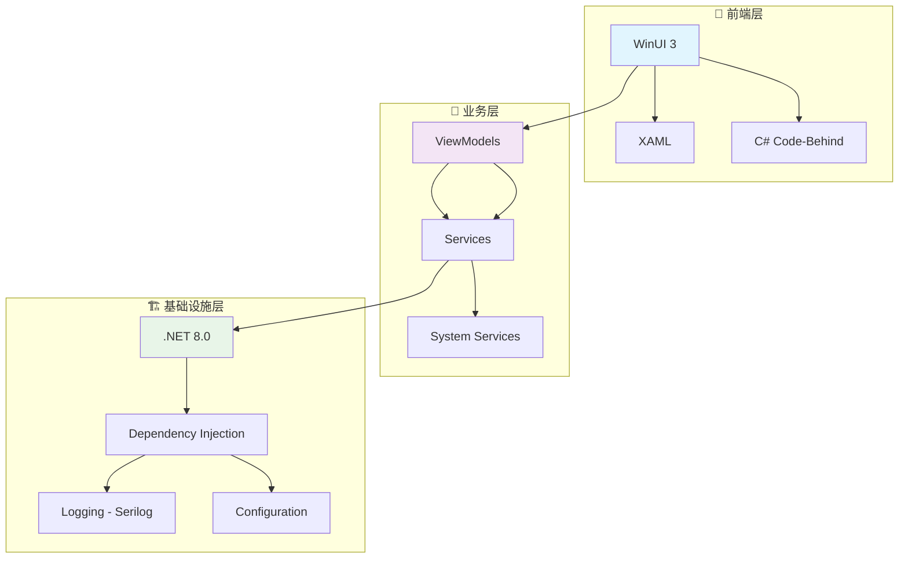

<div align="center">

# 🏛️ WinVault
## 新一代Windows系统管理平台 | Next-Generation Windows System Management Platform

```ascii
██╗    ██╗██╗███╗   ██╗██╗   ██╗ █████╗ ██╗   ██╗██╗  ████████╗
██║    ██║██║████╗  ██║██║   ██║██╔══██╗██║   ██║██║  ╚══██╔══╝
██║ █╗ ██║██║██╔██╗ ██║██║   ██║███████║██║   ██║██║     ██║
██║███╗██║██║██║╚██╗██║╚██╗ ██╔╝██╔══██║██║   ██║██║     ██║
╚███╔███╔╝██║██║ ╚████║ ╚████╔╝ ██║  ██║╚██████╔╝███████╗██║
 ╚══╝╚══╝ ╚═╝╚═╝  ╚═══╝  ╚═══╝  ╚═╝  ╚═╝ ╚═════╝ ╚══════╝╚═╝

    🏛️ 专业级Windows系统管理平台 | Professional Windows Management Platform
    🚀 基于WinUI 3 + .NET 8构建 | Built with WinUI 3 + .NET 8
    ⚡ 现代化架构 + 企业级功能 | Modern Architecture + Enterprise Features
```

<p align="center">
  
</p>


### 🌟 **为什么选择WinVault？**

<table align="center">
<tr>
<td align="center">🎯<br><b>零学习成本</b><br>直观界面设计</td>
<td align="center">⚡<br><b>极致性能</b><br>原生WinUI 3</td>
<td align="center">🔒<br><b>安全可靠</b><br>开源透明</td>
<td align="center">🚀<br><b>持续创新</b><br>活跃开发</td>
</tr>
</table>

[](https://www.gnu.org/licenses/gpl-3.0)
[](https://dotnet.microsoft.com/download/dotnet/8.0)
[](https://docs.microsoft.com/en-us/windows/apps/winui/)
[](https://www.microsoft.com/windows/)
[](https://github.com/Fantasy-XY808/WinVault/actions)
[](https://github.com/Fantasy-XY808/WinVault/releases)
[](https://github.com/Fantasy-XY808/WinVault/releases)
[](https://github.com/Fantasy-XY808/WinVault/issues)
[](https://github.com/Fantasy-XY808/WinVault/pulls)
[](https://github.com/Fantasy-XY808/WinVault/stargazers)
[](https://github.com/Fantasy-XY808/WinVault/network/members)

**新一代Windows系统管理平台，为用户提供专业级系统优化、监控和维护解决方案**

[📥 立即下载](#-快速开始) | [📖 使用文档](#-详细功能说明) | [🤝 参与贡献](CONTRIBUTING.md) | [💬 讨论交流](https://github.com/Fantasy-XY808/WinVault/discussions) | [🐛 问题反馈](https://github.com/Fantasy-XY808/WinVault/issues)

---

</div>

## 🌟 项目亮点

<div align="center">

```ascii
╔══════════════════════════════════════════════════════════════╗
║  🏛️ 为什么选择 WinVault 系统宝库？                          ║
╠══════════════════════════════════════════════════════════════╣
║  ✅ 现代化设计    │  基于WinUI 3的流畅体验                   ║
║  ✅ 智能优化      │  高效的系统性能优化                      ║
║  ✅ 专业级工具    │  企业级系统管理功能                      ║
║  ✅ 安全可靠      │  开源透明，社区驱动                      ║
║  ✅ 持续创新      │  前沿技术，持续进化                      ║
╚══════════════════════════════════════════════════════════════╝
```

</div>

## ✨ 核心功能

<div align="center">

### 🖥️ **系统信息模块**
```
🔍 硬件详情查看    📊 性能实时监控    🌡️ 温度状态显示
💾 存储空间分析    🖥️ 显卡信息检测    🔋 电源状态监控
```

### ⚙️ **系统管理模块**
```
🔄 服务启停管理    📋 进程监控控制    📝 注册表安全编辑
🧹 系统垃圾清理    🔧 启动项管理      🛡️ 系统安全检查
```

### 🛠️ **实用工具集**
```
💻 命令行图形化    📁 文件批量处理    🌐 网络诊断工具
🔍 系统诊断检测    📊 性能基准测试    🎯 快速设置面板
```

</div>

## 🚀 快速开始

### 📥 **安装方法**

<div align="center">

| 🎯 **方式** | 📝 **说明** | ⏱️ **时间** | 🎖️ **推荐度** |
|:---:|:---:|:---:|:---:|
| **直接下载** | 从Releases下载安装包 | 2分钟 | ⭐⭐⭐⭐⭐ |
| **源码构建** | 克隆仓库自行编译 | 5分钟 | ⭐⭐⭐⭐ |
| **包管理器** | 通过winget安装 | 1分钟 | ⭐⭐⭐⭐⭐ |

</div>

#### 🎯 **方法一：直接下载（推荐）**
```bash
# 1. 访问Releases页面
https://github.com/Fantasy-XY808/WinVault/releases/latest

# 2. 下载对应架构的安装包
WinVault-Setup-x64.exe    # 64位系统
WinVault-Setup-x86.exe    # 32位系统
WinVault-Setup-ARM64.exe  # ARM64系统

# 3. 运行安装程序
双击安装包 → 按向导完成安装 → 启动应用
```

#### 🛠️ **方法二：开发者构建**
```bash
# 克隆仓库
git clone https://github.com/Fantasy-XY808/WinVault.git
cd WinVault

# 还原依赖
dotnet restore

# 构建项目
dotnet build --configuration Release

# 运行应用
dotnet run --configuration Release
```

#### ⚡ **方法三：包管理器（即将支持）**
```bash
# 通过winget安装（开发中）
winget install Fantasy-XY808.WinVault

# 通过Chocolatey安装（计划中）
choco install winvault
```

## 💻 系统要求

<div align="center">

### 🖥️ **最低配置**
| 组件 | 要求 |
|:---:|:---:|
| **操作系统** | Windows 10 1809+ / Windows 11 |
| **处理器** | Intel/AMD 双核 1.8GHz+ |
| **内存** | 2GB RAM |
| **存储** | 100MB 可用空间 |
| **显卡** | 支持DirectX 11 |
| **网络** | 可选（在线功能需要） |

### 🚀 **推荐配置**
| 组件 | 要求 |
|:---:|:---:|
| **操作系统** | Windows 11 22H2+ |
| **处理器** | Intel/AMD 四核 2.4GHz+ |
| **内存** | 4GB+ RAM |
| **存储** | 500MB+ 可用空间 |
| **显卡** | 独立显卡或集成显卡 |
| **网络** | 宽带连接（最佳体验） |

</div>

## 🔧 技术架构

<div align="center">

### 💻 技术栈可视化



### 🛠️ 核心技术栈

<p align="center">
  
</p>

</div>

| 层级 | 技术选型 | 版本 | 说明 |
|:---:|:---:|:---:|:---:|
| **🎨 UI层** | WinUI 3 | 1.5+ | 现代化Windows应用界面 |
| **🧠 业务层** | C# | 12.0 | 高性能业务逻辑实现 |
| **🏗️ 框架层** | .NET | 8.0 | 跨平台运行时环境 |
| **📐 架构模式** | MVVM + Clean Architecture | - | 清晰的分层架构设计 |
| **💉 依赖注入** | Microsoft.Extensions.DI | 8.0+ | 松耦合组件管理 |
| **📝 日志系统** | Serilog | 3.0+ | 结构化日志记录 |
| **🧪 测试框架** | MSTest | 3.0+ | 单元测试和集成测试 |

## 📖 详细功能说明

### 🖥️ **系统信息模块**
- 🔍 **硬件详情** - CPU、内存、显卡、存储设备完整规格
- 📊 **实时监控** - 温度、使用率、性能指标实时显示
- 🧪 **性能测试** - 内置基准测试和稳定性检测
- 📈 **历史记录** - 系统性能数据历史趋势分析

### ⚙️ **系统管理模块**
- 🔄 **服务控制** - Windows服务的启动、停止、配置管理
- 📋 **进程监控** - 详细的进程信息和资源使用监控
- 📝 **注册表** - 安全的注册表查看、编辑和备份
- 🧹 **系统优化** - 一键清理垃圾文件和优化系统性能

### 🛠️ **实用工具集**
- 💻 **命令工具** - 常用CMD/PowerShell命令的图形化界面
- 📁 **文件处理** - 批量重命名、格式转换、文件分析
- 🌐 **网络诊断** - Ping、端口扫描、网络连接测试
- 🔍 **系统诊断** - 全面的系统健康检查和问题报告

## 📁 项目结构

```
WinVault/
├── 📁 Assets/           # 应用资源文件
├── 📁 Constants/        # 应用常量定义
├── 📁 Controls/         # 自定义控件
├── 📁 Converters/       # 数据转换器
├── 📁 Extensions/       # 扩展方法
├── 📁 Infrastructure/   # 基础架构
├── 📁 Pages/           # 应用页面
├── 📁 Services/        # 服务层
├── 📁 Strings/         # 多语言资源
├── 📁 ViewModels/      # 视图模型
├── 📄 App.xaml/.cs     # 应用程序入口
├── 📄 MainWindow.xaml/.cs # 主窗口
└── 📄 WinVault.csproj  # 项目文件
```

## 🤝 参与贡献

我们欢迎所有形式的贡献！请查看 [贡献指南](CONTRIBUTING.md) 了解详细信息。

### 🚀 **如何贡献**

1. **🍴 Fork项目** - 创建您的项目分支
2. **🌿 创建分支** - `git checkout -b feature/amazing-feature`
3. **💻 编写代码** - 遵循项目编码规范
4. **✅ 测试验证** - 确保所有测试通过
5. **📝 提交更改** - `git commit -m 'Add amazing feature'`
6. **🚀 推送分支** - `git push origin feature/amazing-feature`
7. **🔄 创建PR** - 提交Pull Request

### 🎯 **贡献类型**

- 🐛 **Bug修复** - 发现并修复问题
- ✨ **新功能** - 添加新的功能特性
- 📚 **文档改进** - 完善项目文档
- 🎨 **UI/UX优化** - 改进用户界面和体验
- 🔧 **性能优化** - 提升应用性能
- 🌐 **国际化** - 添加多语言支持

## 📞 联系我们

- **🐛 问题报告**: [GitHub Issues](https://github.com/Fantasy-XY808/WinVault/issues)
- **💡 功能建议**: [GitHub Discussions](https://github.com/Fantasy-XY808/WinVault/discussions)
- **📚 使用文档**: [Wiki页面](https://github.com/Fantasy-XY808/WinVault/wiki)
- **💬 社区交流**: [Discussions](https://github.com/Fantasy-XY808/WinVault/discussions)

## 📄 许可证

<div align="center">

**本项目基于 GPL v3 许可证开源**

[](https://www.gnu.org/licenses/gpl-3.0)

[查看完整许可证](LICENSE)

---

### ⭐ **如果这个项目对您有帮助，请给我们一个Star！**

<div align="center">

```ascii
╔══════════════════════════════════════════════════════════════╗
║                                                              ║
║  🌟 感谢您的支持！您的每一个 Star 都是我们前进的动力！        ║
║                                                              ║
║  🏛️ 让我们一起打造更强大的 WinVault 系统宝库！               ║
║                                                              ║
║  💝 开源让世界更美好，感谢每一位贡献者！                      ║
║                                                              ║
╚══════════════════════════════════════════════════════════════╝
```

</div>

<p align="center">
  
</p>

**让我们一起打造更强大的WinVault系统宝库！**

</div>
